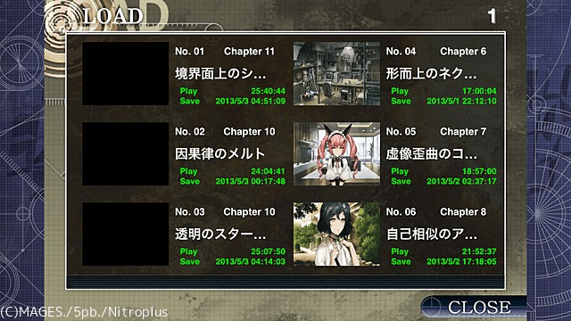
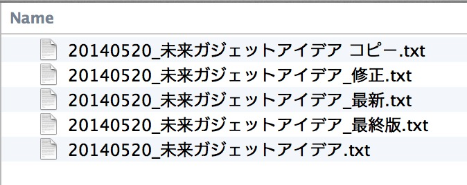

[[easiest-to-version-control]]
== もっとも手軽なバージョン管理

もっとも手軽かつ、よく使われるバージョン管理の手法として「ファイル名を変更する」があります。

Steins;Gateで例えると、以下の画像のように「各章のフォーントリガーがキーになるところでデータをセーブしておく」という手法を使ったことがあるという人はいると思います。

この、ファイル名を変更するバージョン管理の利点として「手軽である」ということです。

ファイルを選択した状態で、Windowsであれば`F2`、Macであれば`Enter`を押すことで、ファイル名の編集ができます。なので、パソコンを初めて起動した直後から、このバージョン管理がおこなえます。

しかし、ファイル名を変更するバージョン管理には、問題点が思いつく限りでも三つあります。それらの問題点について一つずつ詳細に書いていきます。

=== どのファイルを更新すればいいのか分からなくなる

例えば、未来ガジェットのアイデアをひらめいてメモしたいとき、以下のファイル管理方法の場合だと岡部は「はて…どれに書き込めばよかったかな」と困るでしょう。

またこの場合「最終版」と書かれているファイルにひらめいたアイデアを書き込んだものの、実は「最新」と書かれているほうが新しかった…ということが起こる可能性があります。

=== 内容を前のものに戻しづらい、または戻せない

上記で「最終版」と書かれているファイルにひらめいたアイデアを書き込んだときに、それが間違いだと分かり、元のファイルの状態に戻したいとします。しかし、元の状態がどんなものだったか思い出せず、削除しすぎて編集前に書かれていた内容も削除してしまったり、また、追記した内容を完全に消せていなかったりということがあると思います。

これをSteins;Gateのゲームに例えると、データをセーブする場所を間違えて、消したくないセーブデータが消えたという経験がある人もいると思います。

実際に自分は、ラボメンの個別エンディングを見るために残しておいたデータに、誤って別のデータを上書きしてしまい、再度やり直したということがありました。地味につらかったです。

=== 多人数での編集がほぼ不可能

例えば、岡部がひらめいたアイデアを書いたファイルを、ネットワーク上の共有のフォルダに保存していたとします。それを紅莉栖が見て、あれこれ書いて保存したと思ったら、岡部がまた新たなアイデアを同じファイルに書いて保存してしまい、結果、紅莉栖が編集した点が全て消え、元に戻せなくなります。おそらくこのことで二人は口喧嘩することになるでしょう。
