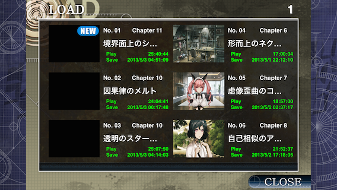
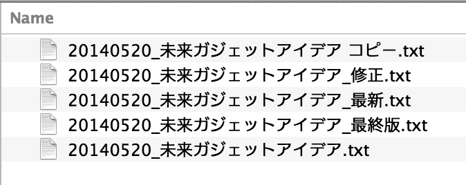

[[easiest-to-version-control]]
== もっとも手軽なバージョン管理

もっとも手軽かつ、よく使われるバージョン管理の手法として、「ファイル名を変更する」があります。

Steins;Gateで例えると、以下の画像のように「各章のフォーントリガーがキーになるところでデータをセーブしておく」という手法を使ったことがあるという人はいると思います。

=== 「ファイル名を変更する」バージョン管理の利点

この、ファイル名を変更するバージョン管理の利点として、「手軽である」ということです。

ファイルを選択した状態で、Windowsであれば`F2`、Macであれば`Enter`を押すことで、ファイル名の編集ができます。なので、パソコンを初めて起動した直後から、このバージョン管理がおこなえます。

しかし、ファイル名を変更するバージョン管理には、問題点が思いつく限りでも四つあります。それらの問題点について一つずつ詳細に書いていきます。

=== どのファイルを更新すればいいのか分からなくなる

例えば、未来ガジェットのアイデアをひらめいてメモしたい時、以下のファイル管理方法の場合だとオカリンは「はて…どれに書き込めばよかったかな」と困るでしょう。

=== 間違ったファイルに書き込んでしまう

上記の図の例だと、「最終版」と書かれているファイルにひらめいたアイデアを書き込んだものの、実は「最新」と書かれているほうが新しかった…ということが起こる可能性があります。

Steins;Gateのゲームでもデータをセーブする場所を間違え、ある時点までのデータが消えたということがあると思います。実際自分は、フェイリスエンドを見るために残しておいたデータに、ルカ子エンドに進むデータを上書きしてしまい、鈴羽エンドへ分岐するデータから再びフェイリスエンドへ分岐するところまでやり直したということがありました。地味につらかったです。

=== 内容を前のものに戻しづらい、または戻せない

例えば、先ほどのセーブデータを間違えて上書きしてしまった例だと、ルカ子エンドに進むようにしてしまったデータを上書きしてしまってそれに気づいたものの、もはや元に戻す方法がなく、仕方なく鈴羽エンドに分岐するところでセーブしておいたデータを、間違えて上書きしてしまったデータのところにセーブしてやり直しました。

=== 多人数での編集がほぼ不可能

例えば、オカリンがひらめいたアイデアを書いたファイルを、ネットワーク上の共有のフォルダに保存していたとします。それを紅莉栖が見て、あれこれ書いて保存したと思ったら、オカリンがまた新たなアイデアを同じファイルに書いて保存してしまい、結果、紅莉栖が編集した点が全て消え、元に戻せなくなります。おそらくこの事で二人は口喧嘩することになるでしょう。
