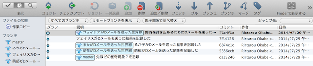
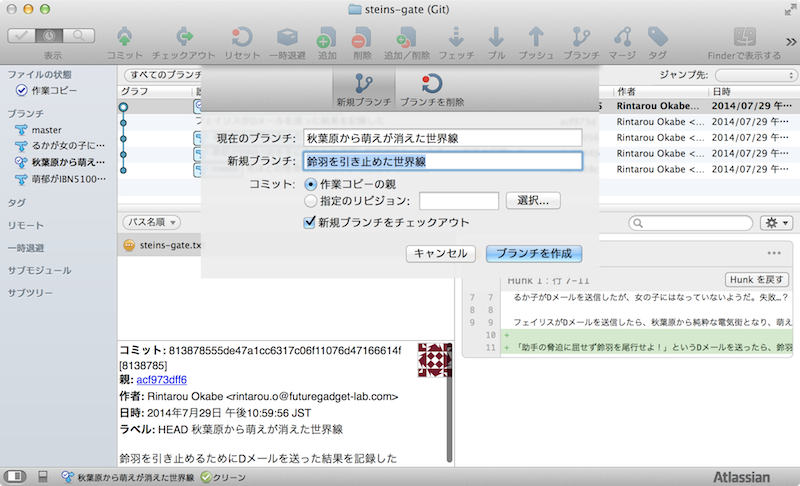
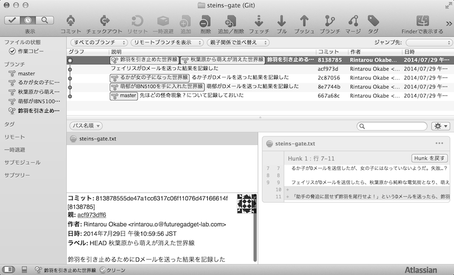

[[git-branch]]

== ブランチの一覧を見たり、ブランチを作ったりする

ブランチの一覧表示をおこなったり、新たにブランチを作成するコマンドです。この「ブランチ」という言葉ですが、シュタゲで例えるならば「世界線」となります。

`git branch`はブランチの一覧を見たり、新たにブランチを作成したり、ブランチを削除したりすることができます。

例えば、現在のブランチが「秋葉原が電気街となり、フェイリスのお父さんが生きている世界線」だとします。その世界線で鈴羽を引き止めるために、岡部がDメールを送信しました。その場合、作業履歴は以下のようになります。

ここから「鈴羽を引き止めるためにDメールを送った後の世界線」に移動します。SourceTreeの上部にある「ブランチ」を押すと、ブランチ名を入力する画面が表示されます。ここで新規ブランチのところに任意の名前を入力します。

「ブランチを作成」を押すと、ブランチができた状態になります。

