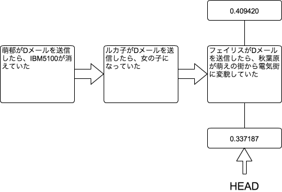

[[git-checkout]]

== ブランチを切り替える

```
git checkout
```

現在のブランチから別のブランチへ移動するコマンドです。例えるならば、電話レンジ(仮)のような機能を実現するコマンドです。

`git branch`の節でも説明しましたが、Gitのブランチは一つの世界線です。`git branch`だけでは世界線を移動することはできませんでしたが、この`git checkout`は世界線を移動したり、現在の世界線の過去に戻る(タイムリープする)ということができます。

=== ブランチを移動する方法

例えば、現在のブランチが0.409420とします。`git branch`でも使った図ですが、以下のような作業履歴をたどっていってます。

image::img/git-branch.png[ブランチの図]

では、先ほど`git branch`の節で作ったブランチに移動します。ブランチを移動するには以下のようにコマンドを実行します。

```
git checkout 0.337187
```

これで0.337187というブランチに移動しました。今作業しているブランチを示すHEADは0.337187を指し示しています。



この状態で`git branch`を実行すると、以下のように表示されます。現在作業している0.337187というブランチの左横にアスタリスクが付きました。

```
  0.409420
* 0.337187
```

=== 現在のブランチの過去に戻る方法

また、`git checkout`はタイムリープをすることもできます。例えば、以下の作業履歴があったとします。

```
commit 20100815
Author: Kyouma Hououin <sg-epk@jtk93.x29.jp>
Date: Sun Aug 15 17:00:00 2010 +0900

    コミマの帰りにまゆりが死んでしまった…

commit 20100814
Author: Kyouma Hououin <sg-epk@jtk93.x29.jp>
Date: Sat Aug 14 17:00:00 2010 +0900

    襲撃は結局一日伸びただけだった

commit 20100813
Author: Kyouma Hououin <sg-epk@jtk93.x29.jp>
Date: Fri Aug 13 17:00:00 2010 +0900

    タイムリープマシンが完成したが、ラウンダーに襲撃されまゆりが死んだ…

commit 20100812
Author: Kyouma Hououin <sg-epk@jtk93.x29.jp>
Date: Thu Aug 12 17:00:00 2010 +0900

    鈴羽のタイムマシンを修理したが、失敗したという手紙が届いてしまった

commit 20100811
Author: Kyouma Hououin <sg-epk@jtk93.x29.jp>
Date: Wed Aug 11 17:00:00 2010 +0900

    謎の脅迫メールが来た
```

この状態で、`commit 20100811`の状態に戻りたいという場合は、以下のコマンドを実行することにより、脅迫メールをもらった状態へとタイムリープすることができます。

```
git checkout 20100811
```
