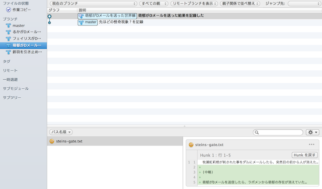

[[git-checkout]]

== ブランチを切り替える

現在のブランチから別のブランチへ移動します。例えるならば、Dメールを送った結果世界線変動が起こった状態を任意のタイミングでおこせるものです。。

前の節でも書きましたが、Gitのブランチは「世界線」です。Steins;GateではDメールによる世界線変動は世界の状況に影響を及ぼしてましたが、Gitでは副作用なしに世界線移動ができます。

切りかえ方としては簡単で、左側にあるブランチのところから、ブランチ名をダブルクリックする事により、ブランチを切り替える事ができます。

