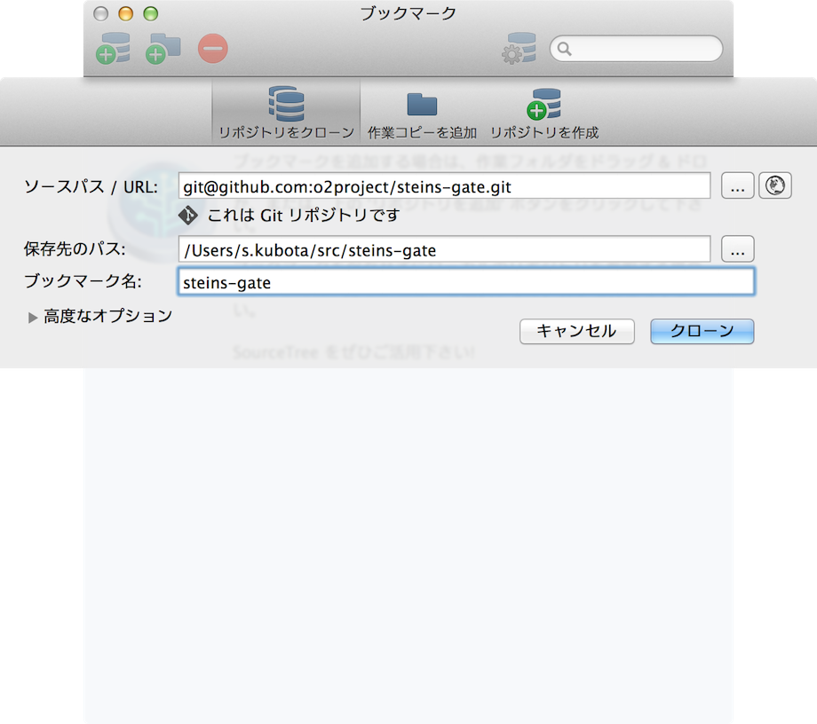

[[git-clone]]

## すでにあるリモートリポジトリを使ってバージョン管理を始める

すでにあるリモートリポジトリを使ってGitによるバージョン管理を始められるようにします。具体的には、リモートリポジトリの完全なコピーを自分のPC上に作ります。

これはリモートリポジトリからコピーを作っているため、最初から他の人(例えばラボメンなど)と共同でタイムリープマシンを使って作業をおこなえる体制が整っています。

では試しに、すでにあるリポジトリの複製を自分のPC上に作りましょう。SourceTreeを起動すると、以下のようなボタンがあると思います。これらのボタンのうち、一番左のボタンを押します。

押した後、「リポジトリをクローン」を押すと以下のような画面になります。「ソースパス / URL」の部分に`git@github.com:o2project/steins-gate.git`を入力して「クローン」を押すと、「steins-gate」というリモートリポジトリの完全なコピーが、自分のPC上に作られます。

