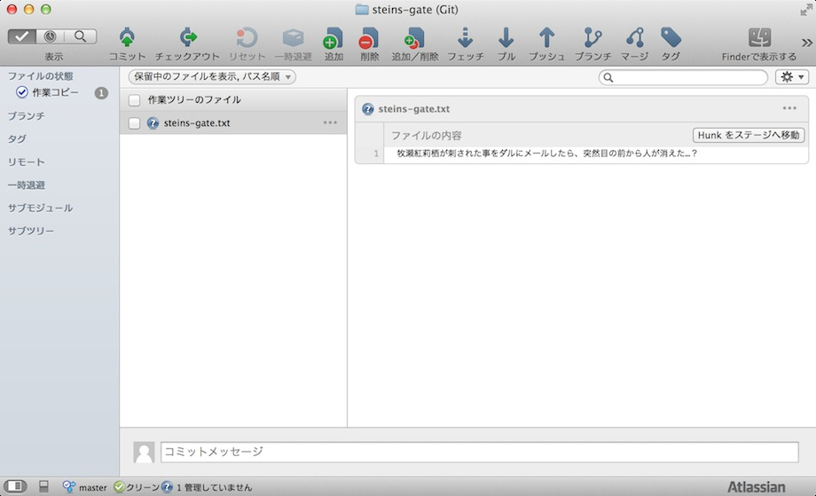
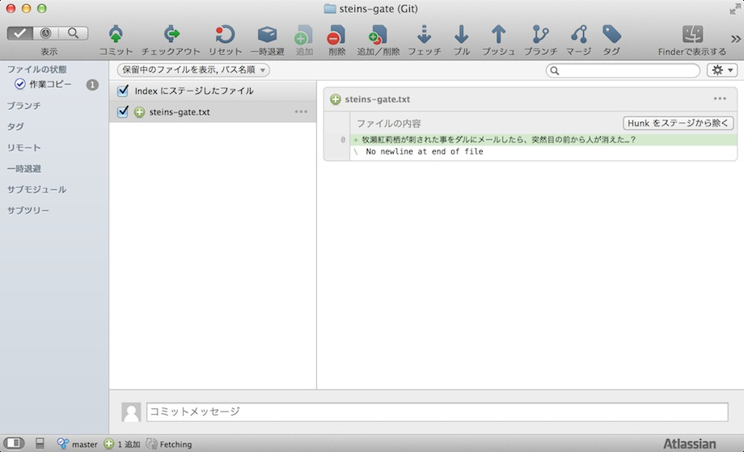
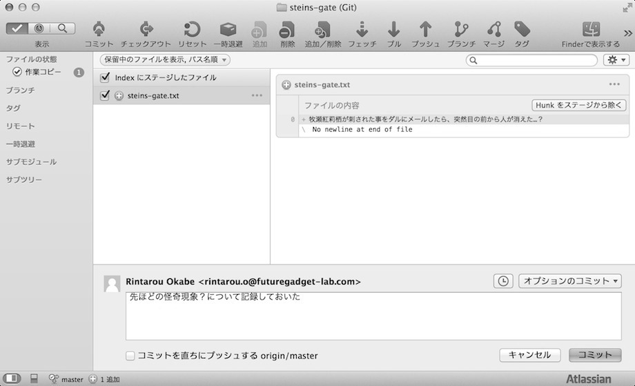

[[git-commit]]

== 作業内容を記録する

作業内容をリポジトリに記録します。例えるならば、セーブをするようなものです。

新規に作ったファイルの場合、最初は以下のように表示されています。

ここでチェックを付けると「ステージングエリア」と一般的に言われるところに移動します。

この状態で画面の下部にあるコミットメッセージというところに任意のメッセージを入力します。

これで「コミット」ボタンを押すと、作業したファイルがリポジトリに記録されます。2回目以降は画面上部にある「コミット」ボタンを押すとコミットメッセージを入力する画面になります。

image::img/git-commit-after.jpg[コミットした後, 460]

ちなみに、上記の図で「ラベル」のところに「HEAD」という文字がありますが、これは「今どのブランチにいるかを判別する情報」です。つまりダイバージェンスメーターのようなものです。
