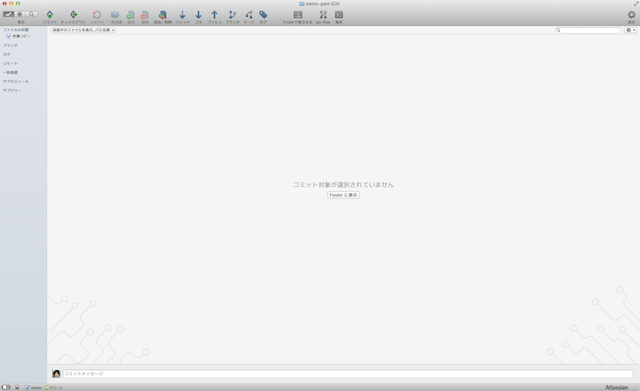

[[git-init]]

## Gitによるバージョン管理を始める

任意のフォルダでGitによるバージョン管理ができるようにするコマンドです。例えるならば、未来ガジェット研究所でタイムリープマシンが作られた状態にするコマンドです。

SourceTreeを起動すると、以下のようなボタンがあると思います。このボタンのうち、一番左のボタンを押します。

image::img/git-init/git-init-sourcetree-select.png[SourceTreeのボタン]

ボタンを押すと、いくつか選択肢が出てきますが、その内「リポジトリを作成」というのを選択します。すると、リポジトリ保存先などが表示されるので、任意のフォルダを選択します。

image::img/git-init/git-init-sourcetree-init.png[リポジトリ名を決めている状態]

作成ボタンを押すと、空のリポジトリができます。これでタイムリープマシンが作られた状態になります。ただし、まだ何も作業内容がないので、過去に戻ったり、過去を改変したりということはできません。

