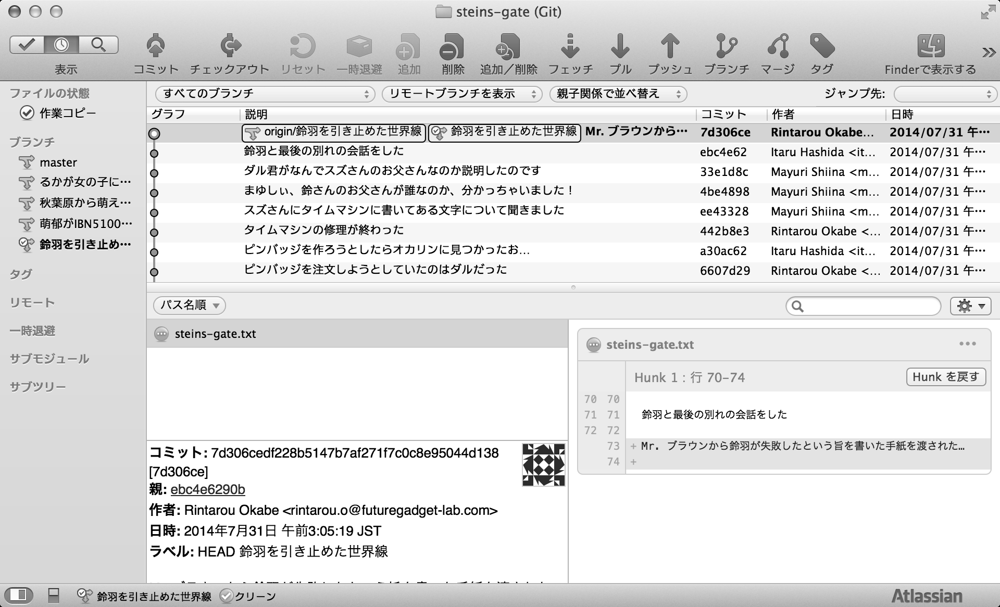
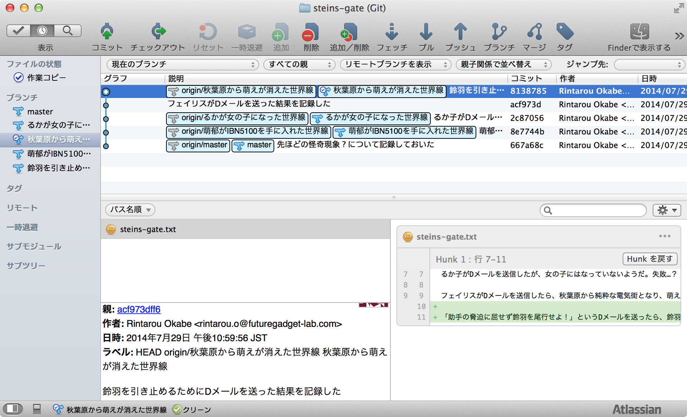
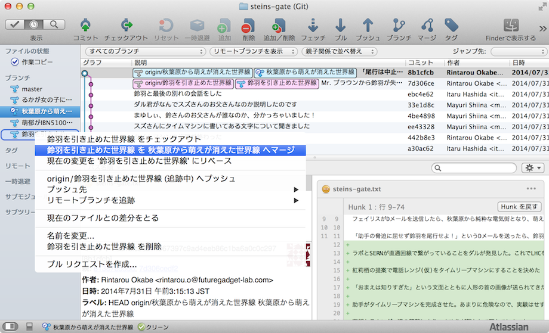
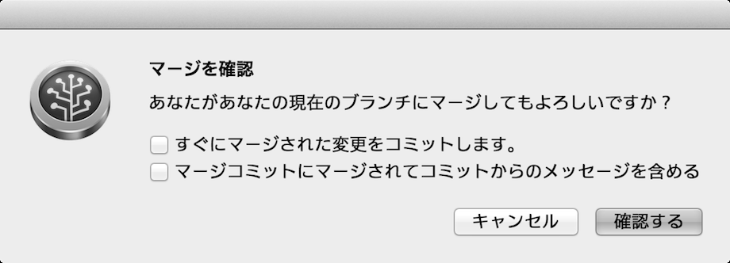
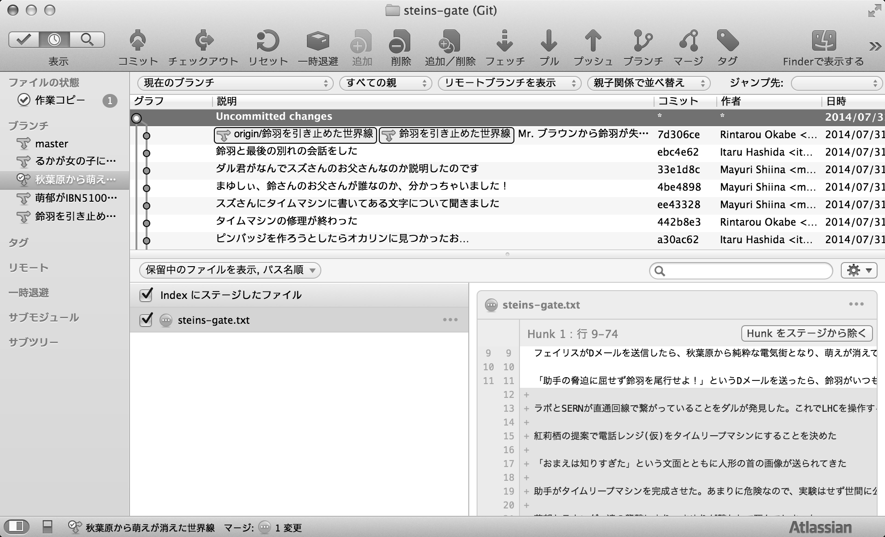
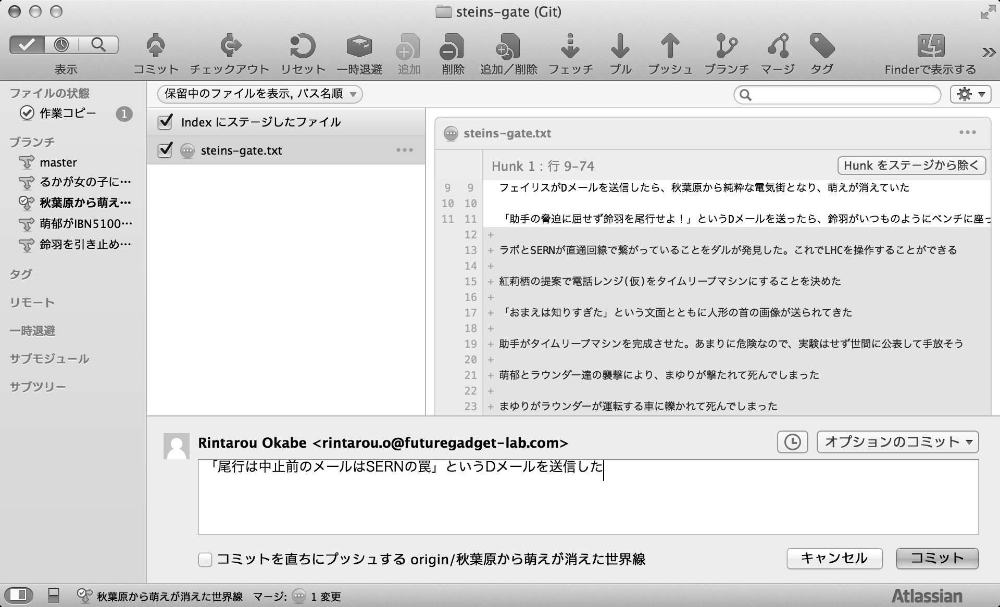
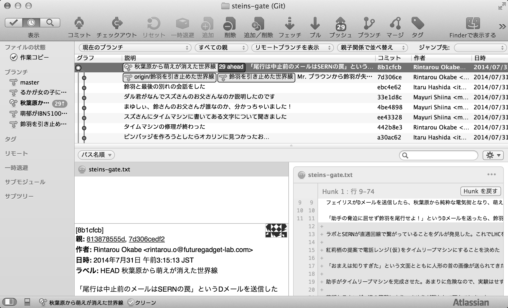

[[git-merge]]

== 別のブランチでの作業内容を取り込む

別ブランチの作業内容を現在のブランチに取り込みます。例えるならば、世界線を収束させるコマンドです。

鈴羽を引き止めた世界線で作業をした結果、鈴羽がタイムトラベルに失敗し「失敗した失敗した失敗した失敗した失敗した」と何度も書いた手紙を書き残し自殺してしまいました。

そんなできごとを無かったことにするため、世界線を変動させ、鈴羽を引き止めないようにします。そのためにまず「秋葉原から萌えが消えた世界線」のブランチへ移動します。

移動した結果、Dメールを送った状態が最新の状態となっています。ここから「鈴羽を引き止めた世界線」でおこなってきた作業を「秋葉原から萌えが消えた世界線」に統合します。方法としては、統合したいブランチを右クリックして「"統合するブランチ名" を "統合させたいブランチ名" へマージ」を選択します。

選択すると、確認メッセージが表示されるので「確認する」を押します。

すると「秋葉原から萌えが消えた世界線」に「鈴羽を引き止めた世界線」でおこなってきた作業履歴が統合された状態になります。

ただし、まだコミットはしていない状態なのでコミットをします。

コミットが完了しました。このようにDメールを送るように、ブランチ同士を統合することができます。

