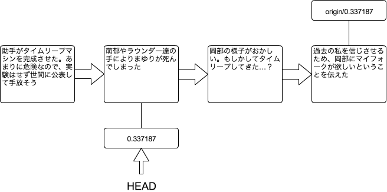
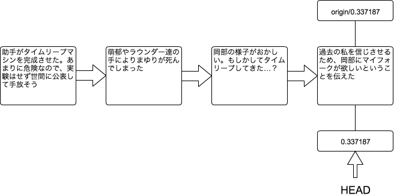

[[git-pull]]

## リモートリポジトリの変更内容を自分のPC上のリポジトリに取り込む

```
git pull
```

他の人がおこなった変更をリモートリポジトリから取得し、自分のPC上のリポジトリに取り込むコマンドとなります。

先ほど`git rebase`のところで、最終的に以下のような作業履歴になっていました。

image::img/git-rebase-after.png[作業履歴をまとめた後の作業履歴]

しかし、岡部以外にもラボメンは作業しています。実際に、今回は紅莉栖が作業していました。



ここで`git pull`をおこなう事により、origin/0.337187の情報が更新され、また、その情報が自分のPC上のリポジトリにマージされます。



先ほどの`git fetch`とは違い、自分のPC上のリポジトリにリモートリポジトリの作業内容が取り込まれます。`git fetch`と`git merge`を同時におこなっているコマンドと言えます。つまり、以下のコマンドを実行したのと同じ事を`git pull`ではおこなっています。

```
git fetch
git merge origin/0.337187
```
