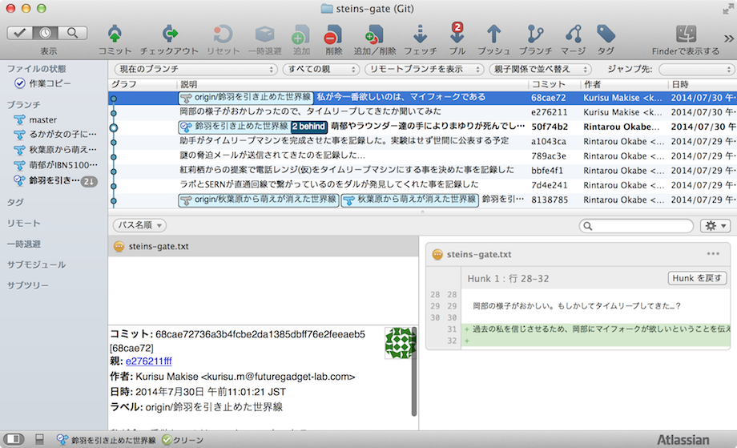
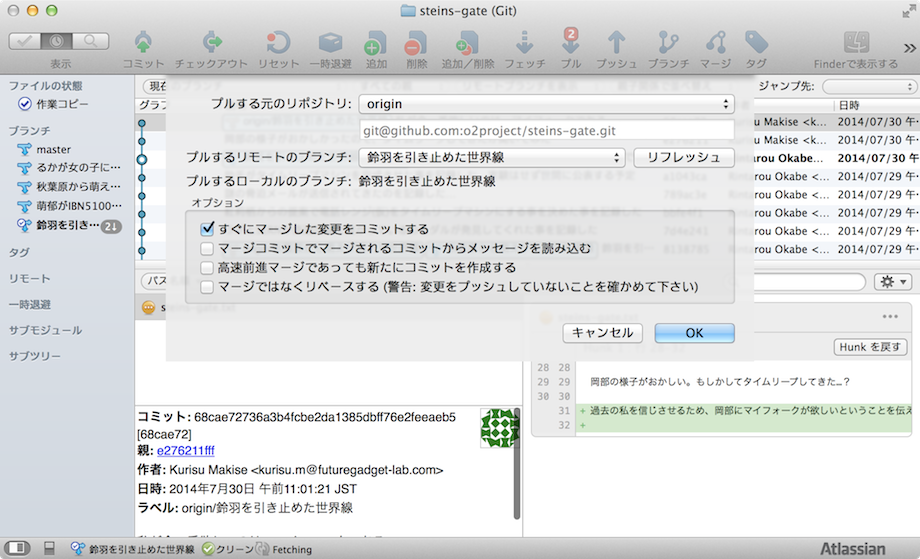
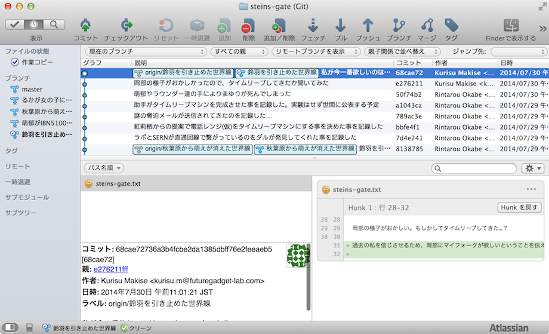

[[git-pull]]

## リモートリポジトリの変更内容を自分のPC上のリポジトリに取り込む

他の人がおこなった変更をリモートリポジトリから取得し、自分のPC上のリポジトリに取り込むコマンドとなります。

リモートリポジトリでは、岡部以外にもラボメンが作業しています。この例だと、紅莉栖が、岡部の様子がおかしいのでタイムリープしてきたかどうか聞いていたり、マイフォークが欲しいという事を言ったという事を記録していたりします。

自分のPC上のリポジトリ(鈴羽を引き止めた世界線)に比べ、リモートリポジトリ(origin/鈴羽を引き止めた世界線)が2つ進んでいます。

ここで、画面上部の「プル」を押します。たいていの場合は表示された画面内の「OK」を押せば大丈夫です。

「OK」を押す事により、リモートリポジトリと自分のPC上の作業履歴が同期されます。

