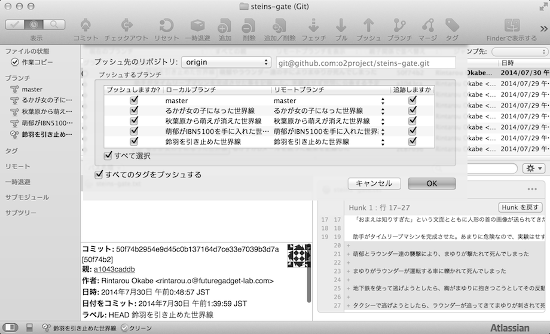
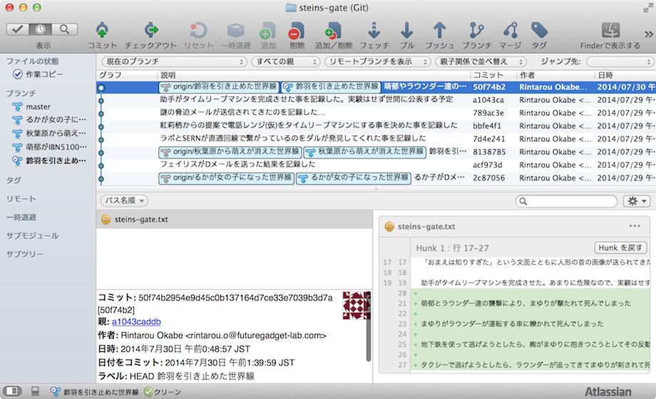

[[git-push]]

## リモートリポジトリに作業内容を送る

自分がおこなった作業内容を、リモートリポジトリに送信するコマンドです。

今まで岡部は、まゆりを助けるために何度もタイムリープをし奮闘してきましたが、その事は他のラボメンは知りません。奮闘している事を知らないままタイムリープマシンを壊そうとしても、紅莉栖に止められるのはしかたない事です。

なので、他のラボメン(今回の場合だと紅莉栖)に今まで岡部がしてきた作業内容を伝える必要があります。その手段がこれからおこなう事です。

