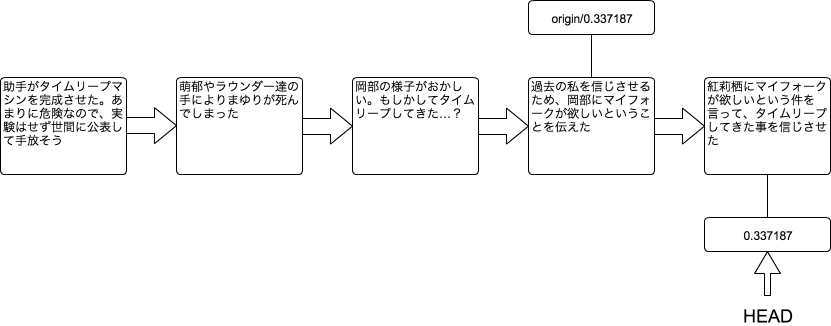
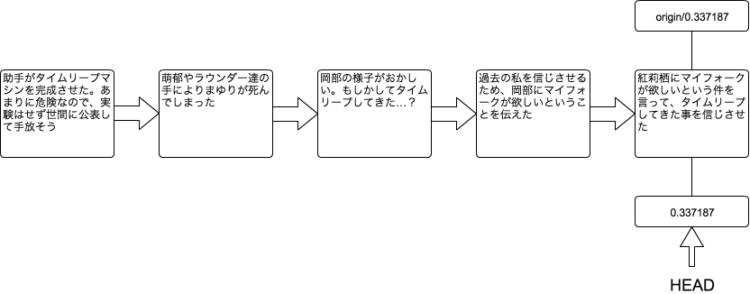

[[git-push]]

## リモートリポジトリに作業内容を送る

```
git push
```

自分がおこなった作業内容を、リモートリポジトリに送信するコマンドです。

`git pull`のところで、紅莉栖はマイフォークが欲しいということを岡部に伝えました。その後に岡部はタイムリープし、紅莉栖にタイムリープしてきた事を伝えましたが、なかなか信じてくれません。

そこで岡部は、「今助手が欲しいものはマイフォーク」という事を伝え、タイムリープしてきた事を信じさせました。それを作業履歴に表すと以下のようになります。



この状態では、まだ自分のPC上にしか「紅莉栖が今欲しい物はマイフォーク」と言った作業履歴がありません。リモートリポジトリにも紅莉栖に言ったという作業履歴を反映させるためには、以下のコマンドを実行します。

```
git push origin 0.337187
```

このコマンドを実行する事により、リモートリポジトリにも紅莉栖に言ったという作業履歴が反映されます。


