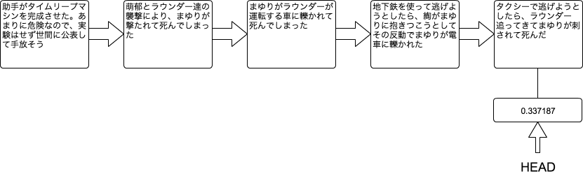

[[git-rebase]]

== 作業履歴を改変する

```
git rebase -i
```

作業履歴を改変するコマンドです。

例として、電話レンジ(仮)を改造してタイムリープマシンができた後、萌郁やラウンダー達の襲撃により、まゆりが殺されてしまった後の作業履歴を示します。



この時に先ほど説明した`git log`に`--oneline`というオプションを付けて実行すると、以下のような作業履歴を見ることができます。

```
$ git log --oneline
95f4c50 タクシーで逃げようとしたら、ラウンダー追ってきてまゆりが刺されて死んだ
e9ad957 地下鉄を使って逃げようとしたら、綯がまゆりに抱きつこうとしてその反動でまゆりが電車に轢かれた
c8101be まゆりがラウンダーが運転する車に轢かれて死んでしまった
6a8c951 萌郁とラウンダー達の襲撃により、まゆりが撃たれて死んでしまった
a2fffd8 助手がタイムリープマシンを完成させた。あまりに危険なので、実験はせず世間に公表して手放そう
```

=== コミットメッセージを変更する

では初めに、コミットメッセージを変更します。先ほどの作業履歴のうち、一番上で「ラウンダー追ってきて」と、間に「が」が足りないメッセージになってしまっています。これを修正します。そのためにまずは以下のコマンドを実行します。

```
git rebase -i HEAD^
```

すると以下の画面が表示されます。ここで「pick」となっているところを、「reword」に変更します。

```
pick cdd5e0d タクシーで逃げようとしたら、ラウンダー追ってきてまゆりが刺されて死んだ

# Rebase a2fffd8..cdd5e0d onto a2fffd8
#
# Commands:
#  p, pick = use commit
#  r, reword = use commit, but edit the commit message
#  e, edit = use commit, but stop for amending
#  s, squash = use commit, but meld into previous commit
#  f, fixup = like "squash", but discard this commit's log message
#  x, exec = run command (the rest of the line) using shell
#
# These lines can be re-ordered; they are executed from top to bottom.
#
# If you remove a line here THAT COMMIT WILL BE LOST.
#
# However, if you remove everything, the rebase will be aborted.
#
# Note that empty commits are commented out
```

すると、コミットメッセージを編集できます。ここでは「が」を付け加えて保存します。

```
タクシーで逃げようとしたら、ラウンダーが追ってきてまゆりが刺されて死んだ

# Please enter the commit message for your changes. Lines starting
# with '#' will be ignored, and an empty message aborts the commit.
# rebase in progress; onto e9ad957
# You are currently editing a commit while rebasing branch 'master' on 'e9ad957'.
#
# Changes to be committed:
#       modified:   test.txt
#
```

コミットメッセージを編集した後、改めて`git log --oneline`を実行すると、一番上のコミットメッセージが修正されていることが確認できます。

```
d1b661b タクシーで逃げようとしたら、ラウンダーが追ってきてまゆりが刺されて死んだ
e9ad957 地下鉄を使って逃げようとしたら、綯がまゆりに抱きつこうとしてその反動でまゆりが電車に轢かれた
c8101be まゆりがラウンダーが運転する車に轢かれて死んでしまった
6a8c951 萌郁とラウンダー達の襲撃により、まゆりが撃たれて死んでしまった
a2fffd8 助手がタイムリープマシンを完成させた。あまりに危険なので、実験はせず世間に公表して手放そう
```

=== 複数の作業履歴を一つにまとめる

次に、まゆりが死んだという複数の履歴を一つにまとめます。一つにまとめるには上記の作業履歴の状態の場合、以下のコマンドのどちらかを実行します。

```
git rebase -i HEAD^^^^
git rebase -i a2fffd8
```

少し解説をします。`HEAD^^^^`というのは、この場合現在の変更内容から数えて、四つ前の変更内容を指します。つまりこの場合は、`a2fffd8`の変更内容を指すことになります。下はそのまま`a2fffd8`の変更内容を指しています。

いずれかのコマンドを実行すると以下のような編集画面が表示されます。この画面では対象となる作業履歴に対して、どういう変更を加えるかという情報が書かれています。画面上部では作業履歴が、画面下部ではどのような変更を加えられるかの説明が書かれています。

```
pick 6a8c951 萌郁とラウンダー達の襲撃により、まゆりが撃たれて死んでしまった
pick c8101be まゆりがラウンダーが運転する車に轢かれて死んでしまった
pick e9ad957 地下鉄を使って逃げようとしたら、綯がまゆりに抱きつこうとしてその反動でまゆりが電車に轢かれた
pick 95f4c50 タクシーで逃げようとしたら、ラウンダーが追ってきてまゆりが刺されて死んだ

# Rebase a2fffd8..95f4c50 onto a2fffd8
#
# Commands:
#  p, pick = use commit
#  r, reword = use commit, but edit the commit message
#  e, edit = use commit, but stop for amending
#  s, squash = use commit, but meld into previous commit
#  f, fixup = like "squash", but discard this commit's log message
#  x, exec = run command (the rest of the line) using shell
#
# These lines can be re-ordered; they are executed from top to bottom.
#
# If you remove a line here THAT COMMIT WILL BE LOST.
#
# However, if you remove everything, the rebase will be aborted.
#
# Note that empty commits are commented out
```

では、最初以外の作業履歴でpickとなっているところを、squashと書き換えてみます。

```
pick 6a8c951 萌郁とラウンダー達の襲撃により、まゆりが撃たれて死んでしまった
squash c8101be まゆりがラウンダーが運転する車に轢かれて死んでしまった
squash e9ad957 地下鉄を使って逃げようとしたら、綯がまゆりに抱きつこうとしてその反動でまゆりが電車に轢かれた
squash 95f4c50 タクシーで逃げようとしたら、ラウンダーが追ってきてまゆりが刺されて死んだ
(以下略)
```

そうするとpickとした変更内容に、squashとした変更内容がまとめられます。この状態で編集画面上で保存をおこなうと、新たなコミットメッセージを入力するための画面が表示されます。

```
# This is a combination of 4 commits.
# The first commit's message is:
萌郁とラウンダー達の襲撃により、まゆりが撃たれて死んでしまった

# This is the 2nd commit message:

まゆりがラウンダーが運転する車に轢かれて死んでしまった

# This is the 3rd commit message:

地下鉄を使って逃げようとしたら、綯がまゆりに抱きつこうとしてその反動でまゆりが電車に轢かれた

# This is the 4th commit message:

タクシーで逃げようとしたら、ラウンダーが追ってきてまゆりが刺されて死んだ

# Please enter the commit message for your changes. Lines starting
# with '#' will be ignored, and an empty message aborts the commit.
# rebase in progress; onto a2fffd8
# You are currently editing a commit while rebasing branch 'master' on 'a2fffd8'.
#
# Changes to be committed:
#       modified:   test.txt
#
```

このように、最初は各作業ごとのコミットメッセージが表示されていますが、今回はこれらを使わず新しいコミットメッセージを入力します。

```
萌郁やラウンダー達の手によりまゆりが死んでしまった

# Please enter the commit message for your changes. Lines starting
# with '#' will be ignored, and an empty message aborts the commit.
# rebase in progress; onto a2fffd8
# You are currently editing a commit while rebasing branch 'master' on 'a2fffd8'.
#
# Changes to be committed:
#       modified:   test.txt
#
```

これにより、改めて`git log`で作業履歴を表示すると、以下のように表示されると思います。

```
commit cdd5e0d0b86e16d08f51a57f19e035ba4f43cd59
Author: Kyouma Hououin <sg-epk@jtk93.x29.jp>
Date:   Fri Aug 13 19:46:00 2010 +0900

    萌郁やラウンダー達の手によりまゆりが死んでしまった

commit a2fffd83ac8265b52668694bc9669e8f2bf099b2
Author: Kyouma Hououin <sg-epk@jtk93.x29.jp>
Date:   Fri Aug 13 14:00:00 2010 +0900

    助手がタイムリープマシンを完成させた。あまりに危険なので、実験はせず世間に公表して手放そう
```

図にすると以下のようになります。作業履歴をまとめる前に比べ、かなり簡素になっていることが分かります。

image::img/git-rebase-after.png[作業履歴をまとめた後の作業履歴]
