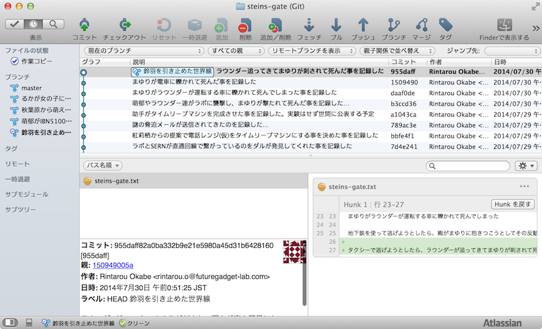
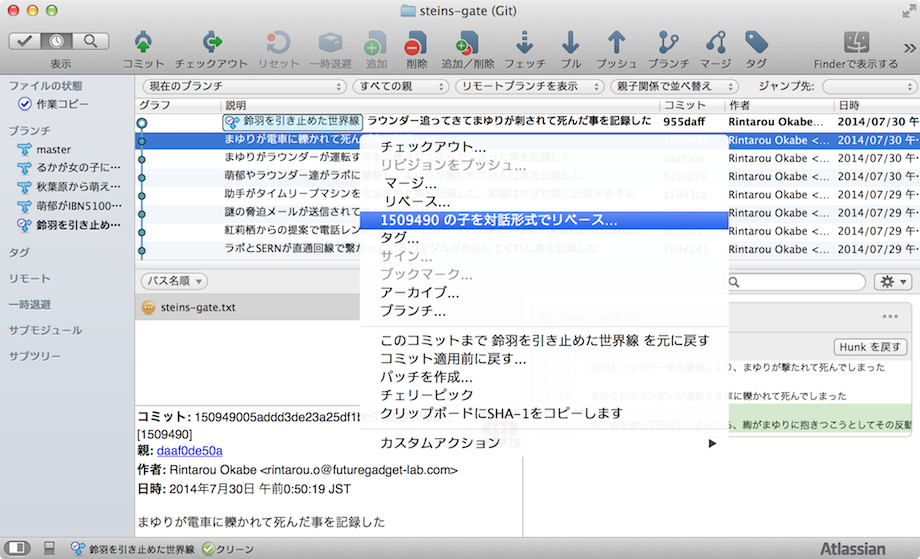
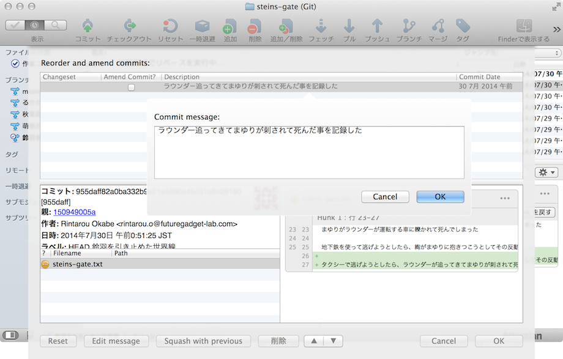
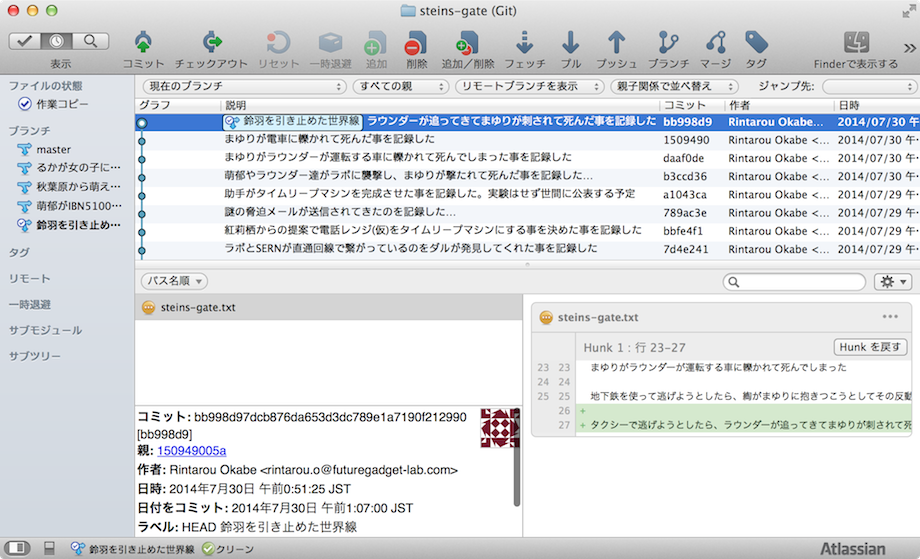
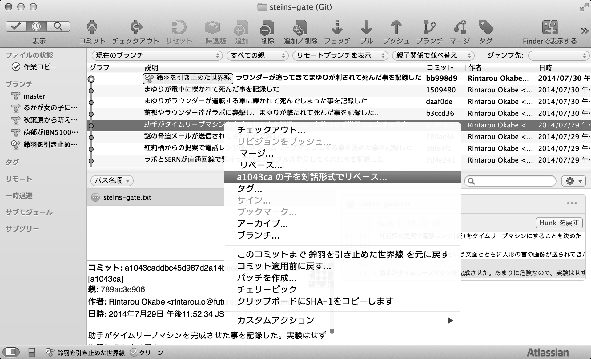
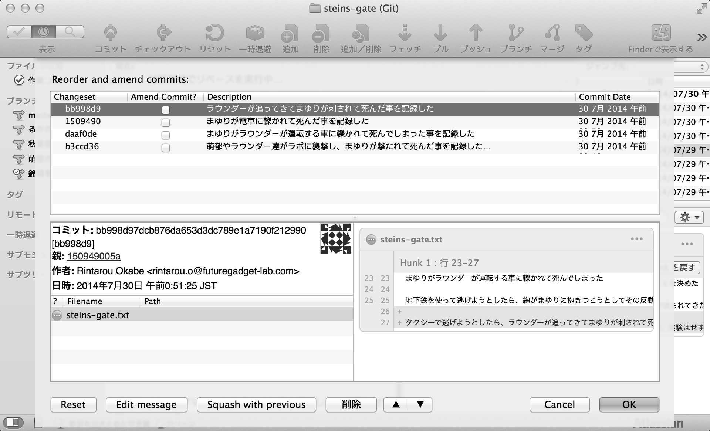
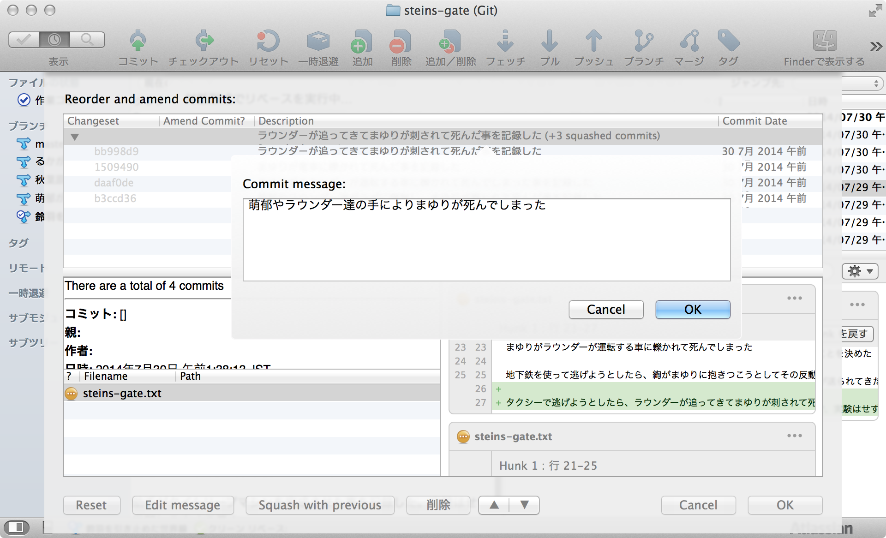
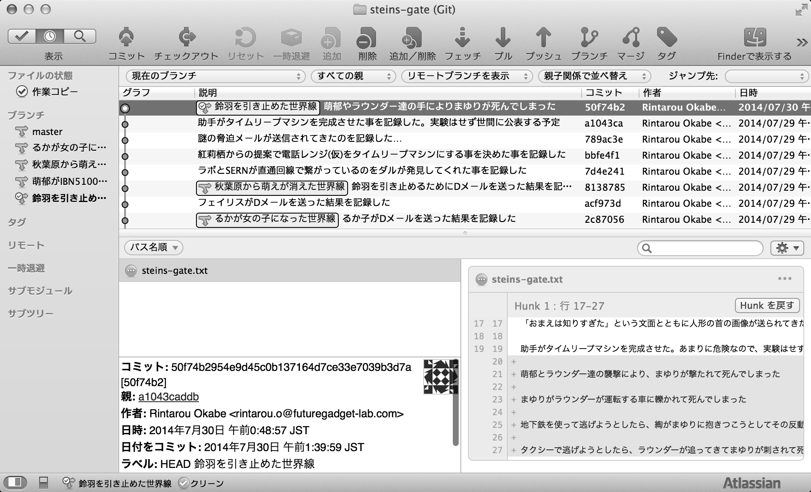

[[git-rebase]]

== 作業履歴を改変する

作業履歴を改変するコマンドです。

例として、電話レンジ(仮)を改造してタイムリープマシンができた後、萌郁やラウンダー達の襲撃により、まゆりが殺されてしまった後の作業履歴を示します。

=== コミットメッセージを変更する

では初めに、コミットメッセージを変更します。先ほどの作業履歴のうち、最新の作業履歴が「ラウンダー追ってきて」と、間に「が」が足りないメッセージになってしまっているので修正します。直したい対象の1つ前の作業履歴を右クリックで選択し、「"コミット番号" の子を対話形式でリベース」を選択します。

すると、対象となる作業履歴が表示されるので、コミットメッセージを直したい作業履歴を選び、下部の「Edit message」を押します。すると、下記の図のようにコミットメッセージを編集する画面が表示されます。

任意のコミットメッセージを書いた後、「OK」ボタンを押すとコミットメッセージが修正されます。

=== 複数の作業履歴を一つにまとめる

次に、まゆりが死んだと書かれた複数の履歴を一つにまとめます。直したい対象の1つ前の作業履歴を右クリックで選択し、「"コミット番号" の子を対話形式でリベース」を選択します。

今回は4つの作業履歴を対象としました。ここから作業履歴をまとめるには「Squash with previous」を3回押します。「まとめる作業履歴の数 - 1回、Squash with previousを押す」と覚えるといいかもしれません。

その後、まとめた作業履歴のコミットメッセージを編集するために「Edit message」を押します。

これで、作業履歴がまとめられました。

