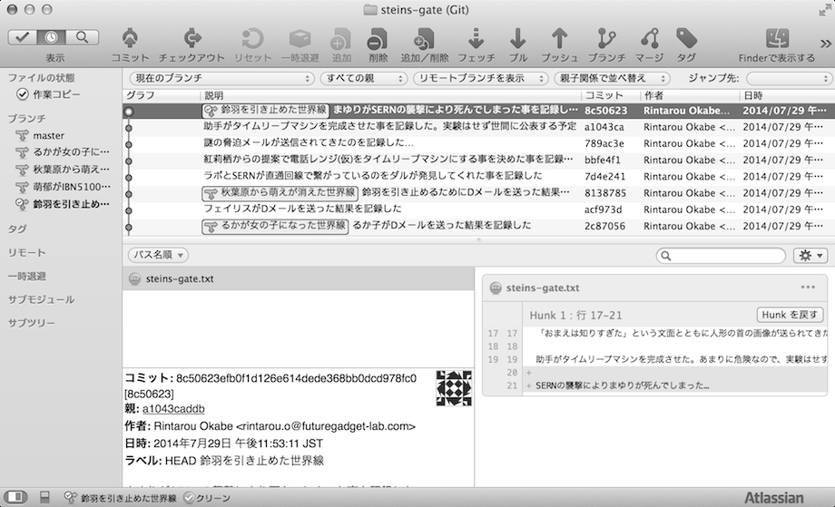
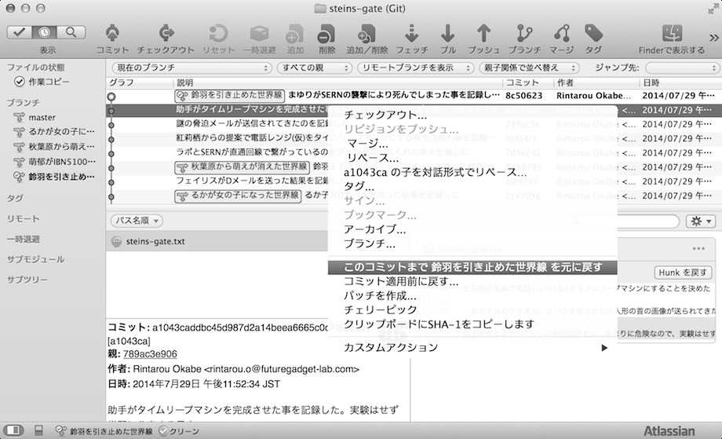
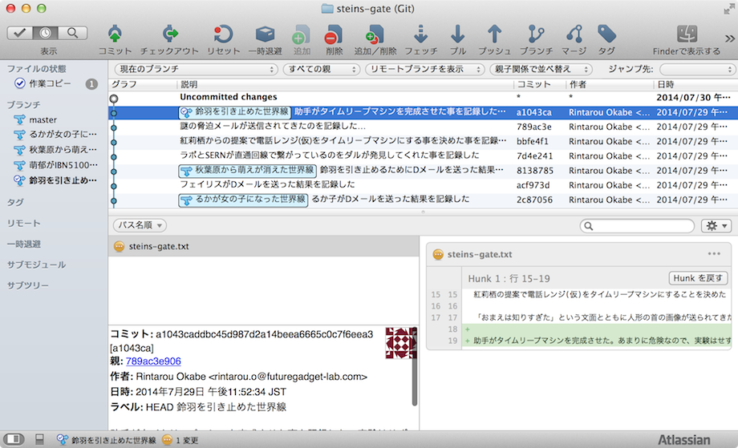

[[git-reset]]

== 変更をリセットする

作業した内容を無かったことにします。例えるならば、タイムリープのようなものです。

鈴羽を引き止めた世界線でいくつか作業をした結果、作業履歴が以下のようになりました。

ここで最新の作業履歴である、「SERNの襲撃によりまゆりが死んでしまった…」という作業を無かったことにし、紅莉栖がタイムリープマシンを完成させたところにタイムリープします。タイムリープするためには、戻したい作業履歴の1つ前の作業履歴を右クリックで選択し、「このコミットまで "ブランチ名" を元に戻す」を選択します。

これで、下記の図のように作業履歴から「SERNの襲撃によりまゆりが死んでしまった…」というのが消えました。

