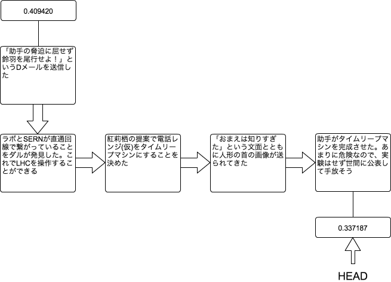

[[git-reset]]

== 変更をリセットする

```
git reset
```

作業した内容を無かったことにするコマンドです。例えるならば、タイムリープのようなコマンドです。

先ほど、`git checkout`のコマンドを実行して、0.337187というブランチに移動しました。このブランチでいくつか作業をした結果、作業履歴は以下のようになりました。

```
commit 20100813b
Author: Kyouma Hououin <sg-epk@jtk93.x29.jp>
Date: Fri Aug 13 19:46:00 2010 +0900

    SERNの襲撃によりまゆりが死んでしまった…

commit 20100813a
Author: Kyouma Hououin <sg-epk@jtk93.x29.jp>
Date: Fri Aug 13 14:00:00 2010 +0900

    助手がタイムリープマシンを完成させた。あまりに危険なので、実験はせず世間に公表して手放そう

commit 20100811
Author: Kyouma Hououin <sg-epk@jtk93.x29.jp>
Date: Wed Aug 11 22:00:00 2010 +0900

    「おまえは知りすぎた」という文面とともに人形の首の画像が送られてきた

commit 20100810b
Author: Kyouma Hououin <sg-epk@jtk93.x29.jp>
Date: Tue Aug 10 21:00:00 2010 +0900

    紅莉栖の提案で電話レンジ(仮)をタイムリープマシンにすることを決めた

commit 20100810a
Author: Kyouma Hououin <sg-epk@jtk93.x29.jp>
Date: Wed Aug 04 20:00:00 2010 +0900

    ラボとSERNが直通回線で繋がっていることをダルが発見した。これでLHCを操作することができる
```

この作業履歴を図にすると下記の図になります。

image::img/git-reset-before.png[git checkout 0.337187でいくつか作業した後の状態]

ここでHEADが指し示している、「SERNの襲撃によりまゆりが死んでしまった…」という作業を無かったことにし、紅莉栖がタイムリープマシンを完成させた履歴に戻ります。戻るためには以下のようなコマンドを実行します。

```
git reset --soft HEAD^
git reset --soft 20100813b #コミット番号を指定
```

これで、下記の図のように作業履歴から「SERNの襲撃によりまゆりが死んでしまった…」というのが消えました。



なお、`git reset --soft`は作業履歴は消えますが、ファイルなどには作業した結果が残ります。その作業した結果も一緒に無かったことにしたい場合は、`git reset --hard`というコマンドを実行します。

```
git reset --hard HEAD^
git reset --hard 20100813b #コミット番号を指定
```

注意点として、`git reset --hard`はやり直しができない、つまり無かったことにしたことを、無かったことにしたいということはできません。なので、注意深くコマンドを実行する必要があります。
